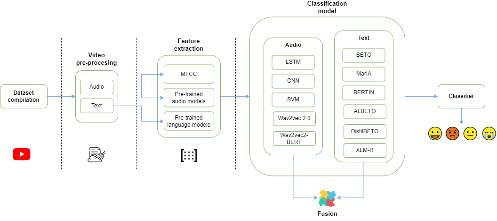

# Spanish MEACorpus 2023
## A multi-modal speech-text corpus for emotion analysis in Spanish from natural environments
[](https://doi.org/10.5281/zenodo.18606423)

Spanish-MEACorpus-2023 is a multimodal Spanish corpus for emotion analysis constructed from YouTube videos.
The dataset combines speech-derived transcriptions, temporal segmentation information, and emotion annotations, enabling research on multimodal and speech-based emotion analysis in Spanish.

The corpus was introduced in the associated scientific publication and is released following the FAIR data principles to facilitate reproducibility and reuse.


### Highlights
- Multimodal corpus for Emotion Recognition in Spanish in natural environments.
- Evaluation of textual and audio features for Speech Emotion Recognition.
- Evaluation of different LLMs for Speech Emotion Recognition.
- Evaluation of a multimodal model with a late fusion approach.
- The multimodal approach improves the overall performance.

### Authors

- **Ronghao Pan** — University of Murcia  
  [Google Scholar](https://scholar.google.com/citations?user=80lntLMAAAAJ) · [ORCID](https://orcid.org/0009-0008-7317-7145)

- **José Antonio García-Díaz** — University of Murcia  
  [Google Scholar](https://scholar.google.com/citations?user=ek7NIYUAAAAJ) · [ORCID](https://orcid.org/0000-0002-3651-2660)

- **Miguel Ángel Rodríguez-García** — UNED
  [Google Scholar](https://scholar.google.com/citations?user=Rn1YH4cAAAAJ&hl=en) · [ORCID](https://orcid.org/0000-0001-6244-6532)

- **Rafael Valencia-García** — University of Murcia  
  [Google Scholar](https://scholar.google.com/citations?user=GLpBPNMAAAAJ) · [ORCID](https://orcid.org/0000-0003-2457-1791)  

> **Affiliations:**  
> \* *Departamento de Informática y Sistemas, Universidad de Murcia, Campus de Espinardo, Murcia, Spain*  
> \* *Universidad Nacional de Educacion a Distancia, Madrid, Spain*

### Publication
https://www.sciencedirect.com/science/article/pii/S0920548924000254

### Abstract
In human–computer interaction, emotion recognition provides a deeper understanding of the user’s emotions, enabling empathetic and effective responses based on the user’s emotional state. While deep learning models have improved emotion recognition solutions, it is still an active area of research. One important limitation is that most emotion recognition systems use only text as input, ignoring features such as voice intonation. Another limitation is the limited number of datasets available for multimodal emotion recognition. In addition, most published datasets contain emotions that are simulated by professionals and produce limited results in real-world scenarios. In other languages, such as Spanish, hardly any datasets are available. Therefore, our contributions to emotion recognition are as follows. First, we compile and annotate a new corpus for multimodal emotion recognition in Spanish (Spanish MEACorpus 2023), which contains 13.16 h of speech divided into 5129 segments labeled by considering Ekman’s six basic emotions. The dataset is extracted from YouTube videos in natural environments. Second, we explore several deep learning models for emotion recognition using text- and audio-based features. Third, we evaluate different multimodal techniques to build a multimodal recognition system that improves the results of unimodal models, achieving a Macro F1-score of 87.745%, using late fusion with concatenation strategy approach.

### Dataset
Each instance in the dataset corresponds to a speech segment extracted from a YouTube video.
The public dataset is provided as a single CSV file:
- `output/spanish-meacorpus-2023-dataset.csv`

This file contains metadata, annotations, temporal segmentation boundaries, and transcriptions for each segment.
Due to copyright restrictions, audio and video files are not redistributed.
Instead, each instance includes a YouTube video identifier and temporal boundaries, enabling rehydration of the original multimedia content.

The repository provides code to automatically download and segment the original videos from YouTube using the provided identifiers and timestamps.

The repository includes scripts to automatically download and segment the original YouTube videos used to construct the dataset.

In particular, the script `code/download-dataset.py` allows reproducing the audio and video segmentation process using the identifiers and temporal boundaries provided in the dataset.


To request the dataset for academic purposes, please fill this form:
https://forms.gle/M668aLqHEuA4Qp1k7

#### Dataset statistics
The table below summarizes the structure of the Spanish MEACorpus 2023 dataset. The corpus contains a total of 5,129 emotionally annotated speech segments, distributed into training and test splits following speaker-independent criteria. Emotion categories show natural imbalance—particularly for fear—reflecting realistic emotional distributions in spontaneous speech. The corpus includes more than 790 minutes of labeled audio, with an average segment duration of approximately 9.2 seconds across all emotion classes.

| Emotion  | Train | Test | Total | Total Length (min) | Avg Length (s) |
|----------|------:|-----:|------:|--------------------:|----------------:|
| anger    |  534  | 134  |  668  | 106.24             | 9.54            |
| disgust  |  960  | 240  | 1200  | 174.82             | 8.74            |
| fear     |   29  |  8   |   37  |  5.13              | 8.31            |
| joy      |  514  | 129  |  643  | 101.84             | 9.50            |
| neutral  | 1600  | 399  | 1999  | 312.66             | 9.38            |
| sadness  |  465  | 117  |  582  |  89.38             | 9.21            |
| **Total**| **4102** | **1027** | **5129** | **790.08** | **9.24** |


#### Data fields

The public dataset includes the following fields:

- `youtube_key`: YouTube video identifier.
- `segment_id`: Identifier of the speech segment.
- `label`: Emotion label assigned to the segment.
- `gender`: Gender of the speaker.
- `start_time`: Start time of the segment (in milliseconds).
- `end_time`: End time of the segment (in milliseconds).
- `transcription`: Text transcription of the speech segment.
- `split`: Data split (train/test).


#### FAIR data and self-assessment
This dataset has been curated following the FAIR (Findable, Accessible, Interoperable, Reusable) data principles.

A FAIR self-assessment has been conducted using the FAIR Data Self-Assessment Tool (FAISS), documenting the use of persistent identifiers, standard metadata, clear access conditions, and detailed provenance information.

The dataset is publicly available through Zenodo and GitHub and is intended for long-term reuse in research on multimodal emotion analysis.


### System architecture

The method proposed in this work can be described as the following Figure. 


In a nutshell, it can de described as follows: first, we compile and annotate the Spanish MEACorpus 2023, a novel multimodal dataset, with different audio segments from YouTube. Then, the video preprocessing module is responsible for cleaning the video, extracting its audio and converting it to text. Next, this dataset is organized into training and testing with a ratio of 80\%-20\%. The former will be used in the training phase and the latter in the evaluation phase. In the feature extraction stage, the training dataset is processed to harvest the most discriminative features of each added sample to train the designed DL architectures. Finally, during the classification phase, we use the test dataset to evaluate the various approaches we have proposed. These include fine-tuning pre-trained text models and pre-trained audio models for ER, as well as testing different fusion approaches for the multimodal model.


### Evaluation
#### Multimodal Classification Results
The table below presents the performance of several multimodal strategies combining audio and text representations. Among the evaluated methods, Late Fusion with embedding concatenation (LF–concat) achieves the best overall performance, obtaining the highest F1-scores for most individual emotions as well as the top macro-F1 (87.75) and weighted-F1 (90.06) results. Ensemble Learning approaches achieve competitive outcomes—particularly for disgust—while the attention-based fusion model underperforms, especially for minority classes such as fear. These results suggest that, for MEACorpus 2023, simple yet expressive fusion strategies outperform more complex attention-based architectures, likely due to class imbalance and the small size of certain emotional categories.

| Emotion | LF (concat) | LF (mean) | Fusion + Attn | EL (mean) | EL (max) |
|---------|------------:|----------:|--------------:|----------:|---------:|
| Anger   | **79.699**  | 77.953    | 77.818        | 76.404    | 75.445   |
| Disgust | 87.967      | 87.190    | 85.892        | **88.211**| 85.288   |
| Fear    | **88.889**  | 75.000    | 36.364        | 82.353    | 80.000   |
| Joy     | **85.714**  | 84.758    | 82.591        | 82.787    | 83.534   |
| Neutral | **97.107**  | 95.443    | 96.139        | 96.059    | 96.287   |
| Sadness | **87.097**  | 84.647    | 80.508        | 83.784    | 86.344   |
| **M-F1**| **87.745**  | 84.165    | 76.552        | 84.933    | 84.483   |
| **W-F1**| **90.064**  | 88.501    | 87.406        | 88.488    | 88.136   |


### Acknowledgments
This work is part of the research projects **LaTe4PoliticES (PID2022-138099OB-I00)** funded by *MCIN/AEI/10.13039/501100011033* and the *European Fund for Regional Development (FEDER)-a way to make Europe* and **LT-SWM (TED2021-131167B-I00)** funded by *MCIN/AEI/10.13039/501100011033* and by the *European Union NextGenerationEU/PRTR*. In addition, this work has been also funded by **``Programa para la Recualificación del Sistema Universitario Español 2021-2023''**, and the *Community of Madrid*, through the **Young Researchers R+D Project. Ref. M2173 – SGTRS** (co-funded by *Rey Juan Carlos University*) and **PEJD-2019-PRE/TIC-16151**.


## Licence
The dataset annotations, transcriptions, and metadata are distributed under the Creative Commons Attribution-NonCommercial 4.0 International (CC BY-NC 4.0) licence.

Audio and video content remain subject to YouTube’s Terms of Service and the original content creators’ rights.


### Citation
```
@article{pan2024spanish,
  title={Spanish MEACorpus 2023: A multimodal speech--text corpus for emotion analysis in Spanish from natural environments},
  author={Pan, Ronghao and Garc{\'\i}a-D{\'\i}az, Jos{\'e} Antonio and Rodr{\'\i}guez-Garc{\'\i}a, Miguel {\'A}ngel and Valencia-Garc{\'\i}a, Rafel},
  journal={Computer Standards \& Interfaces},
  volume={90},
  pages={103856},
  year={2024},
  publisher={Elsevier}
}
```

or cite the Zenodo dataset
```
If you use this dataset, please cite the Zenodo record:

García-Díaz, J. A. et al. (2026).
Spanish-MEACorpus-2023: A Multimodal Spanish Corpus for Emotion Analysis from YouTube.
Zenodo. https://doi.org/10.5281/zenodo.18246241
```


